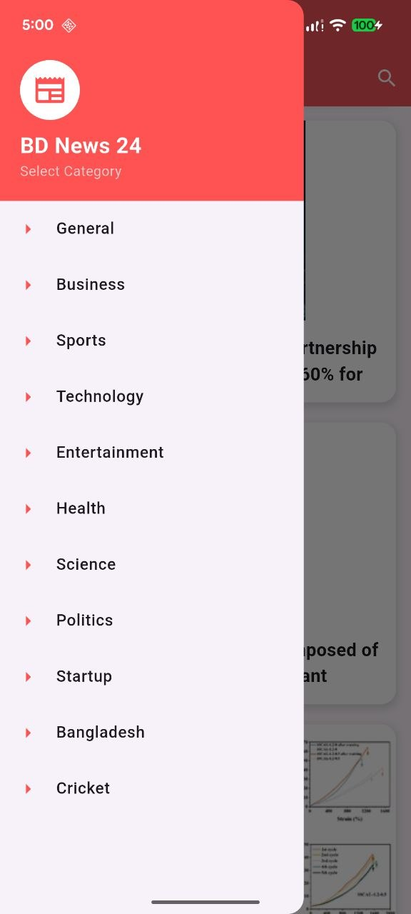

# 📰 BD News 24

**BD News 24** is a modern, feature-rich news application built with **Flutter**. It fetches real-time news data from a REST API and categorizes it for a seamless user experience.

## ✨ Features

- **🔴 Live News Integration:** Fetches real-time articles using NewsAPI.org.
- **📂 Smart Categories:** Tab-based navigation for **Sports (Cricket)**, **Business**, **Technology**, and General News.
- **⚡ Optimized Performance:** Uses `cached_network_image` for smooth image loading and offline caching.
- **🎨 Modern UI:** Custom card design with shadows, rounded corners, and clean typography.
- **👆 Interactive:** Tap on any news card to view full details with high-quality images.

## 📱 Screenshots

  
  

  
  

## 🛠 Tech Stack

- **Framework:** Flutter (Dart)
- **State Management:** `setState` (Clean Architecture approach)
- **Networking:** `http` package
- **Image Handling:** `cached_network_image`
- **Design:** Material Design

